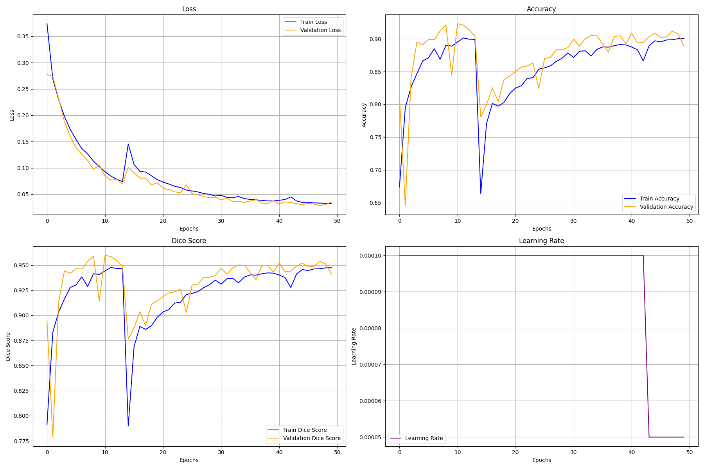

# Unet: Training setup

This is a simple implementation of the Unet model for semantic segmentation. The model produces a mask that identifies the pixels of the input image that belong target class.

This repo contains simple implementation for training the model.
features:
    - Snapshotting: save model and optimizer state at intervals
    - Best model saving: save the model with the best validation loss
    - Metrics: produces plots and sample predictions at intervals

## Usage
training setup requires data in the following format:

```
.../dataset/
    images/
        image1.jpg
        image2.jpg
        ...
    masks/
        image1.jpg
        image2.jpg
        ...
```
Splitting data into subsets for training validation and testing is done using the ```get_dataloaders``` funtion as you set ratios for each subset.
the ```datasets``` folder contains a script file with functions to convert yolo annotations to the required formats.

## Metrics examples


## Sample predictions
